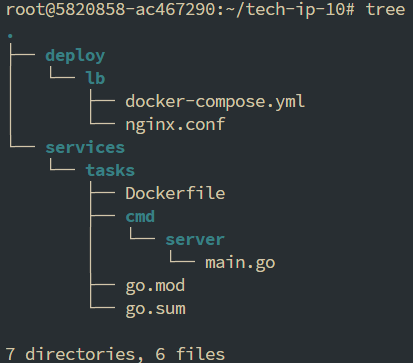
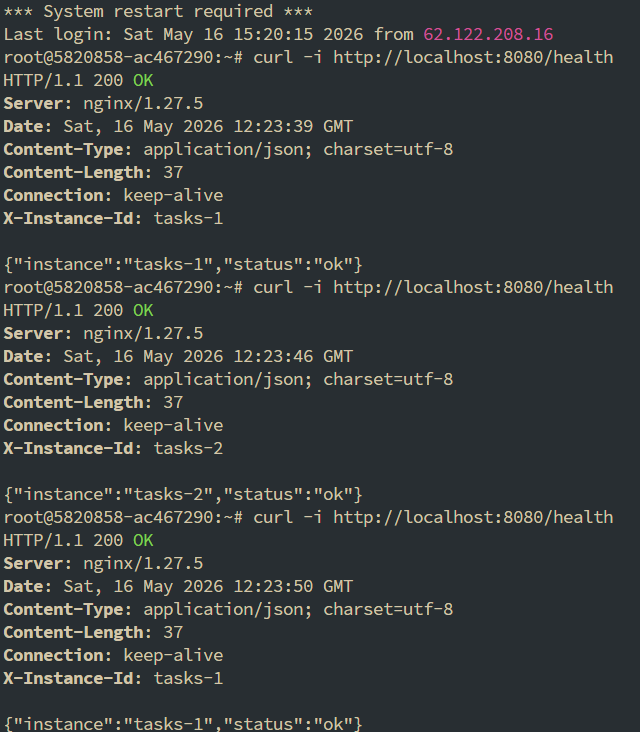
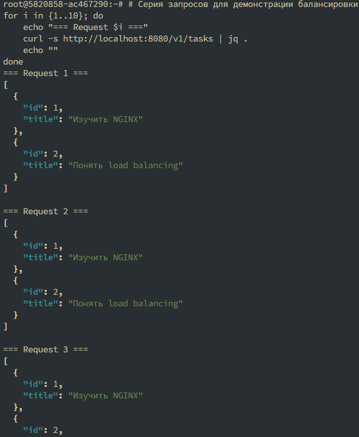
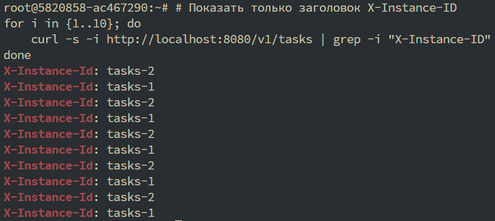
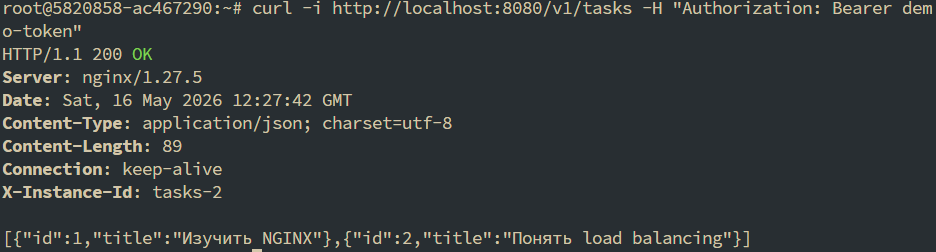
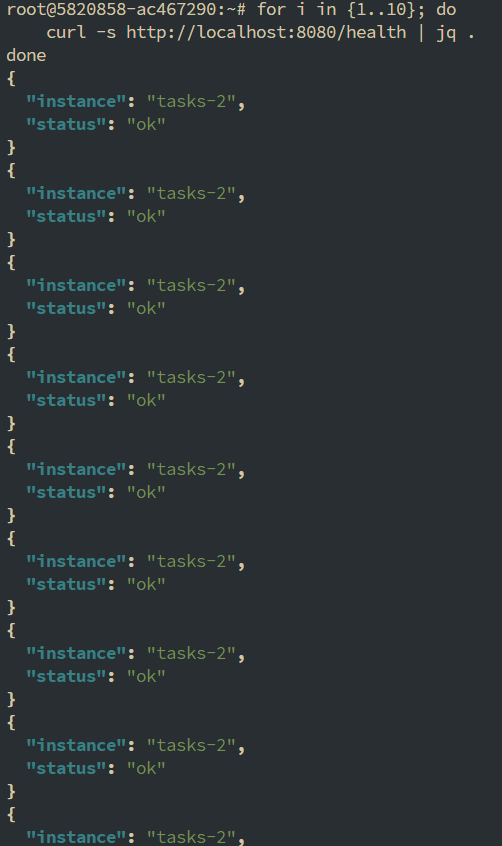
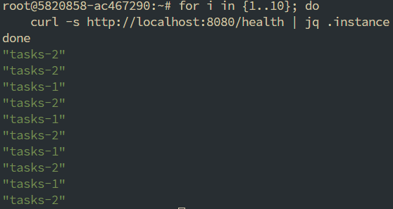
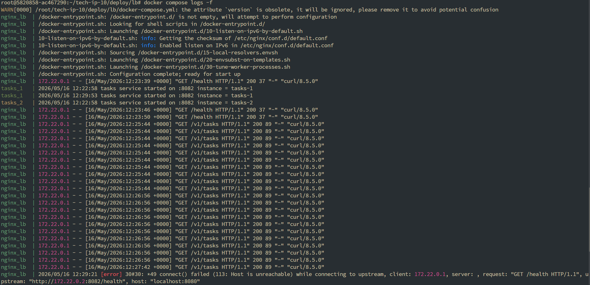

# Практическое занятие №10: Горизонтальное масштабирование с NGINX Load Balancer

## Описание

В рамках практической работы реализовано горизонтальное масштабирование Go-сервиса `tasks` с помощью NGINX в качестве балансировщика нагрузки.  
Запущены две реплики сервиса, трафик распределяется между ними методом round-robin.  
Добавлен заголовок `X-Instance-ID`, позволяющий наглядно увидеть, какой экземпляр обработал запрос.

---

## Структура проекта



### 1. Запуск стенда

```bash
cd deploy/lb
docker compose up -d --build
```

### 2. Проверка балансировки через /health



### 3. Серия запросов к /v1/tasks



### 4. Проверка распределения через X-Instance-ID


### 5. Передача авторизационного заголовка


### 6. Отказоустойчивость
Останавливаем одну реплику
```bash
docker compose stop tasks_1
```


Восстанавливаем реплику
```bash
docker compose start tasks_1
```


### 7. Логи


### 8. Выводы

- NGINX успешно выполняет роль reverse proxy и load balancer.

- Трафик распределяется между двумя репликами (round-robin).

- Заголовок X-Instance-ID позволяет идентифицировать обработавшую реплику.

- При отказе одной реплики система продолжает работать (деградация, а не отказ).

- NGINX корректно проксирует важные заголовки (Authorization, X-Request-ID и др.).

- Горизонтальное масштабирование требует stateless подхода (данные хранятся вне реплик).
